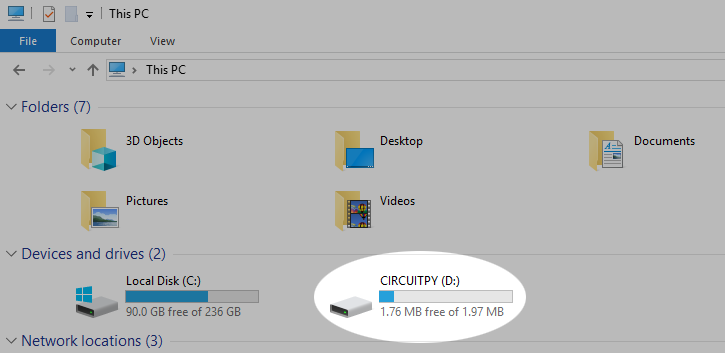
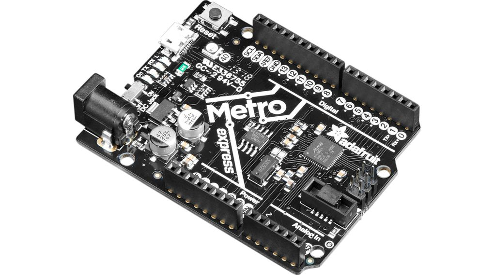
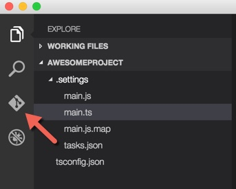

# CircuitPython
My CircuitPython assignments:

*As of 10/30/19, all CircuitPython code is commented*

A really helpful link for figuring out how to code basic things in CircuitPython that you knew how to do in Arduino. https://learn.adafruit.com/arduino-to-circuitpython

## Hello CircuitPython
CircuitPython is a new language that we are learning that is based off of python. We are also using a new board, called a Metro M0 Express. It looks pretty similar to an arduino, but is actually quite different. When you plug it into the computer, it mounts as a drive (on mine E), and whenever you save something called main.py to that drive, it uploads. When using these, you have to type "import board" at the beginning of each code to make it work properly. Also, instead of the main loop being called "void loop()" like in Arduino, it is "while True:".

## LED Fade
In this assignment I learned how to code for an LED in circuitpython and then make the LED fade in and out. In order to fade an LED instead of just turn it on or off you need to use pulseio and pwm. This means that you have to make sure that you choose all pwm pins for your LEDS as well. To make the LED look like it is fading in and out, you adjust the duty cycle for the LED.

## Servo Capacitive Touch
This makes a servo move using capacitive touch. There are two wires just plugged into analog pins in the metro, and when either of them are touched, they are grounded. In this assignment, when one wire is touched the servo spins one way, and when the other is touched the servo turns the other way. Google was definitely my friend in this assignment because Capacitive Touch was a completely foreign, albeit not that complicated, concept.

## LCD Screen
For this, an LCD screen displays the number of times a button has been pressed. In addition, there is a switch that will change the direction the counter is going if flipped. To make sure that the button only counted up one each press, even if it was held down, I had to add in an oldButtonState variable.

## Photo Interrupter
In this assignment I learned how to wire the new photo interrupters and how to code for them with circuitpython. In CircuitPython, a photo interrupter can be coded essentially the same as a button, using DigitalIn, which made this assignment pretty easy. In addition, I learned about time monotonic which allowed me to calculate how long it had been since a loop had run, thus enabling me to have something run every four seconds without using time.sleep. When the photo interrupter is interrupted, it adds to a count, and that count prints every four seconds.

 

## Distance Sensor
Here I used an HCSR04 ultrasonic sensor to control the internal RGB LED on the metro. The assignment was to have the LED gradually change colors corresponding to the distance the sensor was reading. For most of the sensor code I was able to look at the HCSR04 library we were using to get information. The hardest part of this assignment was figuring out how to get the RGB LED spectrum working smoothly with the distance values.

## RGB LED
The rgb LED assignment was an introduction to classes and modules. You were giving a code that didn't work, and had to build an RGB class that would make it work. The goal was to create two rgb LED objects, and have them cycle through a number of colors. This assignment used pwm pins for the leds so that thye could fade in and out and not just stay on. One problem that I encountered during this assignment was that I got an error saying that all timers were in use. That just meant that I couldn't use certain pins all at once so I had to change some.

 

## Hello VS Code
This was an introduction to Visual Studio (VS) Code. VS Code is similar to Mu, but a big advantage is that it has built in git. You can add, commit, and push your changes to github, without leaving VS Code. In addition, when you edit your README in VS Code, you can open a preview on the side and see what it will look like.

## Fancy LED
Fancy LED was another assignment similar to rgb LED, where you are getting the hang of making classes. In this one, there were four methods, alternate, blink, chase, and sparkle. For alternate, I had two leds blink and then one led blink. For blink, I had all three leds turn on at once. In chase, I had the first, then the second, then the third leds turn on in turn. For sparkle, I had a random combination of the three leds turn on 50 times really fast.

